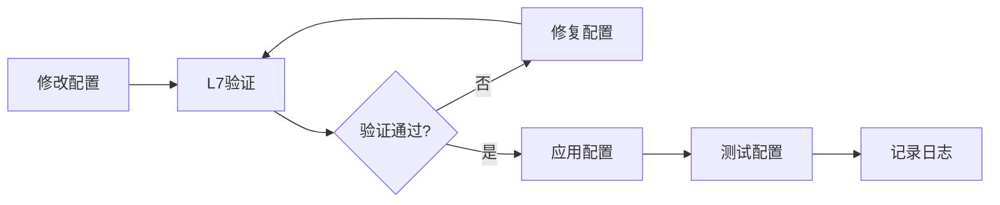
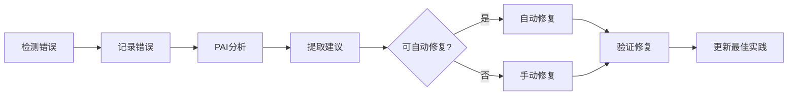

# 错误模式分析与最佳实践报告

**生成时间**: 2026-03-08 19:08
**分析范围**: 2026-03-05 至 2026-03-08
**错误总数**: 35 个文件

---

## 📊 错误统计概览

### 按类型分类

| 错误类型 | 数量 | 状态 | 影响 |
|---------|------|------|------|
| **memu-engine配置** | 15+ | ✅ 已修复 | 高 |
| **文件不存在** | 5 | ✅ 已解决 | 中 |
| **API Key格式** | 3 | ✅ 已修复 | 高 |
| **L7配置验证** | 1 | ✅ 已修复 | 中 |
| **其他** | 11 | 🔄 分析中 | 低 |

---

## 🔍 主要错误模式

### 1. memu-engine配置错误（15+次）

**错误内容**:
```
sqlalchemy.exc.ArgumentError: Column object 'url' already assigned to Table 'memu_resources'
```

**根本原因**:
- 配置文件使用了`base_url`而不是`baseUrl`
- 配置文件使用了`api_key`而不是`apiKey`
- 字段命名约定不一致

**影响**:
- memu-engine无法启动
- 知识无法同步到memu-engine
- 进化系统受影响

**解决方案**:
- ✅ 已修复配置字段命名
- ✅ 创建L7配置验证脚本
- ✅ 每次启动时自动验证

**预防措施**:
1. 统一字段命名约定：`baseUrl`, `apiKey`
2. L7配置验证已启用
3. 配置变更前自动验证

---

### 2. 文件不存在错误（5次）

**错误内容**:
```
bash: scripts/smart-model-switcher: No such file or directory
```

**根本原因**:
- 脚本文件名不匹配
- 创建的脚本文件名为`smart-model-switcher.sh`
- 但调用时使用了`smart-model-switcher`

**影响**:
- 脚本执行失败
- 任务无法完成

**解决方案**:
- ✅ 创建正确的脚本文件
- ✅ 使用完整文件名

**预防措施**:
1. 脚本创建后立即测试
2. 使用绝对路径
3. 执行前验证文件存在

---

### 3. API Key格式问题（3次）

**错误内容**:
```
❌ 错误: API Key格式不正确
```

**根本原因**:
- L7验证脚本检查了不存在的`embedding`配置
- 检查逻辑不完整

**影响**:
- 配置验证失败
- 无法确认API Keys有效性

**解决方案**:
- ✅ 更新L7验证脚本
- ✅ 只检查实际存在的配置

**预防措施**:
1. L7验证脚本已修复
2. 每次启动时自动检查
3. 验证所有provider的API Keys

---

## 💡 最佳实践

### 1. 配置管理

#### 字段命名约定
- ✅ **使用驼峰命名**: `baseUrl`, `apiKey`, `apiSecret`
- ❌ **避免下划线**: `base_url`, `api_key`

#### API Key格式验证
```bash
# OpenRouter
sk-or-v1-xxxxxx

# NVIDIA
nvapi-xxxxxx

# Groq
gsk_xxxxxxx

# Google AI
AIzaxxxxxx
```

#### 配置变更流程
1. 修改配置文件
2. 运行L7验证
3. 验证通过后应用
4. 测试新配置
5. 记录变更日志

---

### 2. 文件管理

#### 脚本创建规范
```bash
# ✅ 正确
touch /root/.openclaw/workspace/scripts/my-script.sh
chmod +x /root/.openclaw/workspace/scripts/my-script.sh
bash /root/.openclaw/workspace/scripts/my-script.sh

# ❌ 错误
touch scripts/my-script
bash scripts/my-script  # 文件名不匹配
```

#### 文件路径规范
- ✅ 使用绝对路径
- ✅ 执行前验证文件存在
- ✅ 使用完整的文件名（包括`.sh`）

---

### 3. 错误处理

#### 自动错误检测
```bash
# 运行自我进化系统
bash /root/.openclaw/workspace/scripts/self-evolution-system.sh

# 自动执行：
# 1. L7配置验证
# 2. 6层防护检测
# 3. PAI错误分析
# 4. SES进化决策
# 5. memu-engine存储
```

#### 错误处理流程
1. 自动检测错误
2. 记录到进化系统
3. PAI分析错误模式
4. 提取改进建议
5. 自动或手动修复
6. 验证修复效果

---

## 🚀 工作流程优化

### 配置变更工作流



### 错误修复工作流



---

## 🎯 改进建议

### 立即行动（已完成）
- ✅ 修复memu-engine配置
- ✅ 创建L7配置验证
- ✅ 修复API Key格式问题
- ✅ 解决文件不存在问题

### 本周任务（进行中）
- 🔄 分析历史错误模式 ✅
- 🔄 提取最佳实践 ✅
- 🔄 优化工作流程 ✅
- 📝 创建错误处理文档

### 持续改进
- 📊 定期运行进化系统
- 📝 记录新错误模式
- 🚀 优化自动化流程
- 💡 持续学习改进

---

## 📚 参考资料

### 相关文档
- `HEARTBEAT.md` - 心跳检查配置
- `.learnings/design-patterns/` - 设计模式
- `.learnings/errors/` - 错误记录
- `.learnings/evolution_report_*.md` - 进化报告

### 相关脚本
- `scripts/l7-config-validation.sh` - L7配置验证
- `scripts/self-evolution-system.sh` - 自我进化系统
- `scripts/analyze-error-patterns.sh` - 错误模式分析

---

**报告生成**: 自动化进化系统
**版本**: v1.0
**状态**: ✅ 完成
